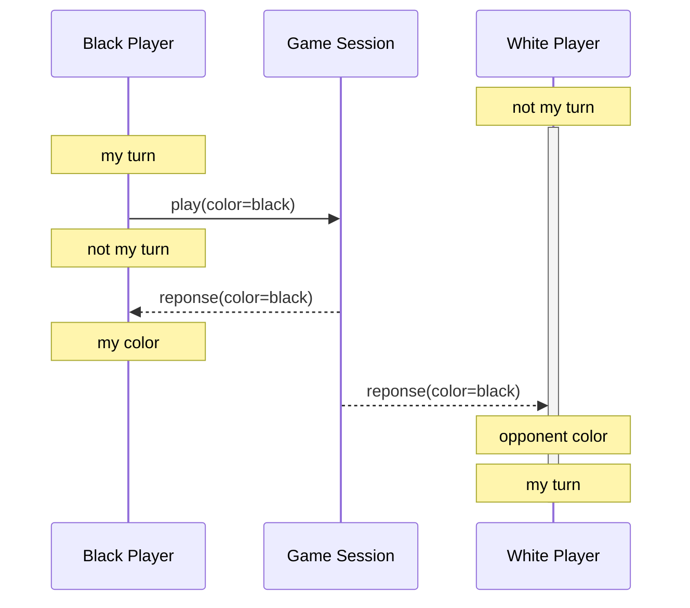
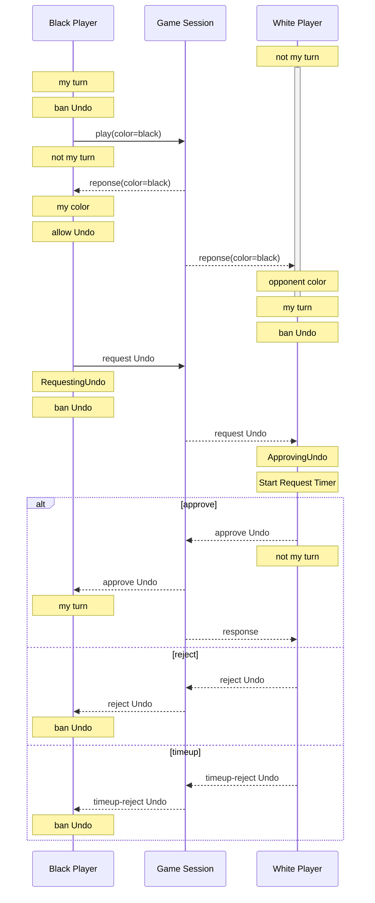
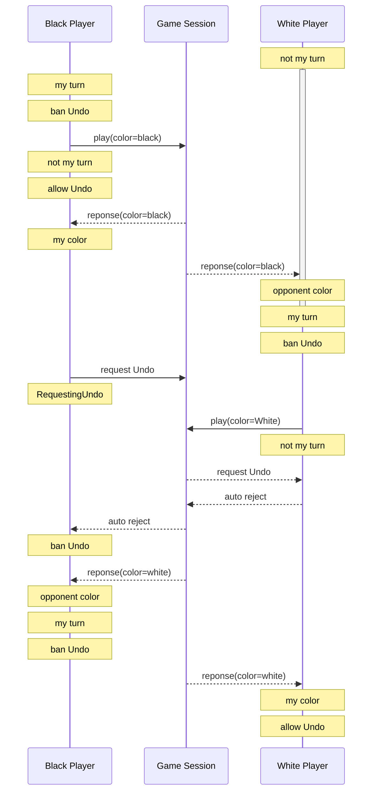

# Session Syncing

## Role Syncing During Play

Sync Rule:

- `not-my-turn` after sending `play`
- `my-turn` after receiving `response` of opponent color

## Syncing Undo

Rules:

- `ban Undo` after sending `Undo request`: can only send once.
- `allow Undo` after receiving `resposne` of my color: do not allow `Undo` if my action is not yet received.
- `auto reject` Undo when `not my turn`: when opponent has sent `Play`, but I have not yet received.
- `ban Undo` after receiving `response` of opponent color: opponent has played.
- `ban Undo` after being `approved`, `auto rejected` or `rejected`: cannot apply once.

### Case 1: White Player has not yet played

### Case 2: White Player has played, but Undo arrived first

